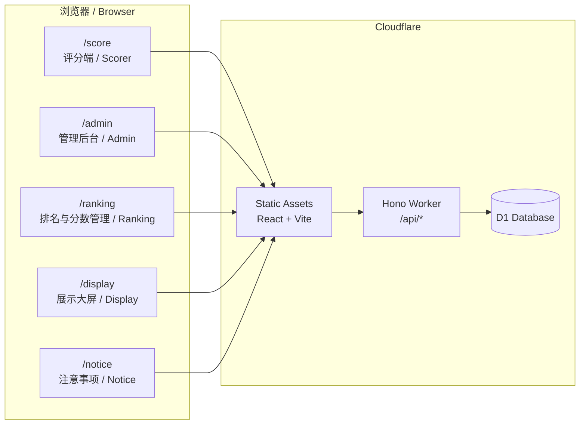
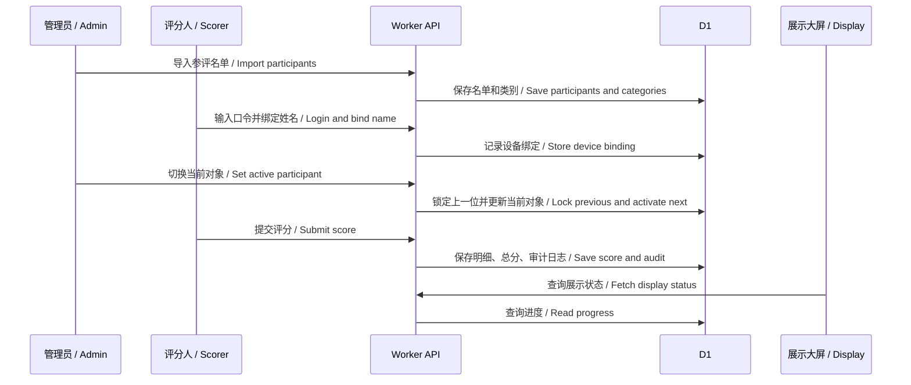
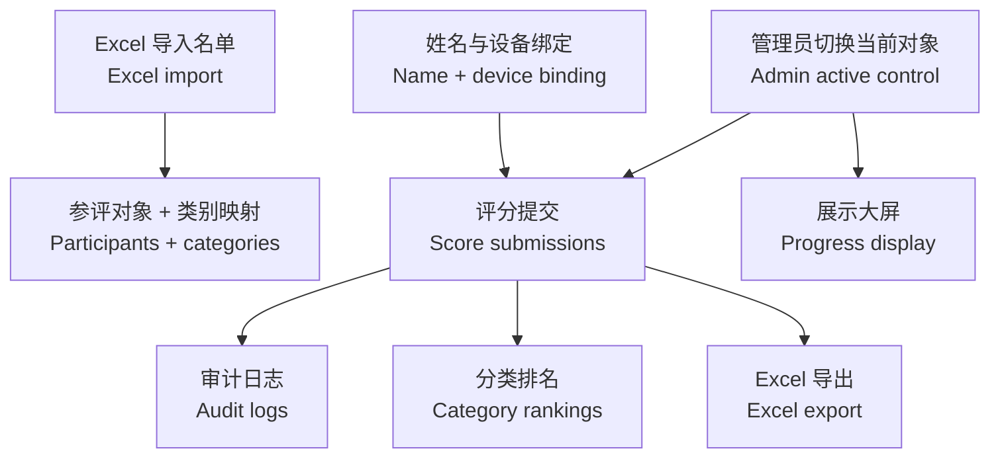

# Evaluation Scoring System / 活动评审评分系统

> 中英双语、可自托管、适合现场评审流程的轻量级评分系统。  
> A bilingual, self-hostable scoring system for structured live evaluation workflows.

[](https://workers.cloudflare.com/)
[](https://react.dev/)
[](https://vite.dev/)
[](https://developers.cloudflare.com/d1/)
[](LICENSE)

适用于面试、招新、竞选、答辩、竞赛评审、评优评先、社团/组织选拔、项目路演、作品评分等场景。  
Suitable for interviews, recruitment, elections, defenses, competitions, awards, club selection, project demos, and work reviews.

本仓库是已脱敏的开源版本，不包含真实参评对象、真实评分、真实设备绑定、真实口令、真实域名或生产数据库信息。  
This is a sanitized open-source version. It contains no real participants, scores, device bindings, passcodes, domains, or production database identifiers.

## 目录 / Contents

- [项目亮点 / Highlights](#项目亮点--highlights)
- [为什么不是普通表单 / Why Not Just Forms](#为什么不是普通表单--why-not-just-forms)
- [系统架构 / Architecture](#系统架构--architecture)
- [现场流程 / On-site Workflow](#现场流程--on-site-workflow)
- [评分模型 / Scoring Model](#评分模型--scoring-model)
- [页面入口 / Pages](#页面入口--pages)
- [快速开始 / Quick Start](#快速开始--quick-start)
- [部署 / Deployment](#部署--deployment)
- [文档 / Documentation](#文档--documentation)

## 项目亮点 / Highlights

| 能力 / Capability | 说明 / Description |
| --- | --- |
| 现场流程控制 / Live flow control | 管理员控制当前对象，评分端跟随现场节奏，不容易打错对象。 Admin controls the active participant so scorers follow the live process. |
| 多身份评分 / Multiple scorer groups | 评委、成员、观众等身份可按不同权重参与成绩计算。 Different scorer groups can use different weights. |
| 分类排名 / Category rankings | 支持按部门、岗位、类别、赛道分别排名，不强制总榜。 Rank by department, position, category, or track without forcing a global leaderboard. |
| 移动端友好 / Mobile-first scoring | 评分端适合手机操作，支持逐项评分和总分一键提交。 Mobile-friendly scoring with detailed item scores or quick total submission. |
| 防重复与审计 / Duplicate control and audit | 设备绑定、单对象唯一有效评分、锁分、废弃评分、审计日志。 Device binding, one effective score per participant, score locks, discard records, and audit logs. |
| 大屏展示 / Public display | 展示当前对象和参评进度，不公开分数、均分或个人评价。 Display current progress without exposing sensitive scores. |
| Cloudflare 低成本部署 / Low-cost Cloudflare deployment | Workers + D1 + static assets，适合短期活动和轻量组织流程。 Workers + D1 + static assets for lightweight event operations. |

## 为什么不是普通表单 / Why Not Just Forms

| 常见方案 / Alternative | 痛点 / Limitation | 本项目 / This project |
| --- | --- | --- |
| 问卷/表单 / Forms | 容易选错对象，统计和排名要后期整理。 Easy to score the wrong participant; ranking requires manual cleanup. | 当前对象由管理员控制，系统自动汇总排名。 Admin-controlled participant and automatic rankings. |
| 投票工具 / Polling tools | 更适合投票，不适合多维度加权评分。 Better for voting than weighted multi-dimensional scoring. | 支持评分项、身份权重、分类排名。 Supports scoring items, scorer weights, and category rankings. |
| Excel 手工统计 / Spreadsheets | 现场慢、易错、无法自然实时展示。 Slow on site, error-prone, not naturally real-time. | 在线提交、实时排名、结束后导出 Excel。 Online submission, real-time ranking, final Excel export. |
| 账号系统 / Account systems | 短期活动建账号成本高。 Too much account setup for short events. | 统一口令 + 首次姓名绑定设备。 Passcodes plus first-time device binding. |
| 公开排名屏 / Public leaderboards | 容易暴露分数和个人评价。 Can expose scores and judgments. | 展示屏只显示进度，不显示分数。 Display screen shows progress only. |

更多说明 / More details: [docs/WHY.md](docs/WHY.md)

## 系统架构 / Architecture



## 现场流程 / On-site Workflow



## 数据流 / Data Flow



## 评分模型 / Scoring Model

> 当前仓库里的 5 大项、15 细项只是默认示例模板，不是系统必须固定的评分规则。  
> The 5 sections and 15 items in this repository are default examples, not a required fixed scoring model.

默认示例 / Default example:

| 大项 / Section | 分值 / Points |
| --- | ---: |
| 仪容仪表与言行举止 / Appearance and conduct | 15 |
| 语言表达能力 / Communication | 20 |
| 认知与能力匹配 / Role fit | 30 |
| 思想态度与素养 / Attitude | 20 |
| 临场应变与综合表现 / On-site performance | 15 |

你可以把它替换成其他模型，例如：  
You can replace it with another model, for example:

- 项目路演：创新性、商业价值、技术实现、表达答辩、落地可行性
- 竞赛评审：作品完成度、创意表达、技术难度、现场答辩、综合表现
- 招新选拔：岗位匹配、沟通表达、责任意识、执行经验、团队协作
- 课程答辩：选题意义、方法过程、成果质量、答辩表现、材料规范

自定义说明 / Customization guide: [docs/SCORING_MODEL.md](docs/SCORING_MODEL.md)

最终成绩默认公式 / Default final score formula:

```text
评委均分 * 0.7 + 成员均分 * 0.3
judge_average * 0.7 + member_average * 0.3
```

## 页面入口 / Pages

| 路径 / Path | 用途 / Purpose |
| --- | --- |
| `/score` | 评分端 / Scorer mobile page |
| `/admin` | 管理后台 / Admin console |
| `/ranking` | 排名与分数管理 / Ranking and score management |
| `/display` | 展示大屏 / Public display screen |
| `/notice` | 现场注意事项 / On-site instructions |

## 快速开始 / Quick Start

```bash
npm install
cp .dev.vars.example .dev.vars
npm run dev
```

本地访问 / Local URLs:

- `http://127.0.0.1:5173/score`
- `http://127.0.0.1:5173/admin`
- `http://127.0.0.1:5173/ranking`
- `http://127.0.0.1:5173/display`
- `http://127.0.0.1:5173/notice`

## 环境变量 / Environment Variables

```env
APP_SECRET=replace-with-a-long-random-secret
JUDGE_PASSCODE=change-this-judge-passcode
MEMBER_PASSCODE=change-this-member-passcode
ADMIN_PASSCODE=change-this-admin-passcode
```

生产环境请使用足够长、不可猜测、每次活动单独设置的口令。  
Use long, unpredictable, event-specific passcodes in production.

## 部署 / Deployment

```bash
npx wrangler d1 create evaluation-scoring
npm run db:migrate:local
npx wrangler d1 migrations apply evaluation-scoring --remote
npm run build
npx wrangler deploy
```

详细部署说明 / Full guide: [docs/DEPLOYMENT.md](docs/DEPLOYMENT.md)

## 数据导入导出 / Import and Export

参评名单导入 Excel 前四列 / Import participants from the first four Excel columns:

| 列 / Column | 含义 / Meaning |
| --- | --- |
| 第 1 列 / Column 1 | 序号 / Serial number |
| 第 2 列 / Column 2 | 姓名 / Participant name |
| 第 3 列 / Column 3 | 第一意向部门/类别 / First-choice department/category |
| 第 4 列 / Column 4 | 第二意向部门/类别 / Second-choice department/category |

安全示例模板 / Safe sample template: `examples/participants-template.csv`

活动结束后导出 / Export after the event:

```bash
D1_DATABASE_NAME=evaluation-scoring node scripts/export-interview-data.mjs
```

## 文档 / Documentation

- [为什么选择这个系统 / Why this project](docs/WHY.md)
- [评分模型自定义 / Scoring model customization](docs/SCORING_MODEL.md)
- [部署指南 / Deployment guide](docs/DEPLOYMENT.md)
- [架构说明 / Architecture](docs/ARCHITECTURE.md)
- [安全与隐私 / Security and privacy](docs/SECURITY.md)
- [贡献指南 / Contributing](CONTRIBUTING.md)

## 开源协议 / License

MIT. See [LICENSE](LICENSE).
